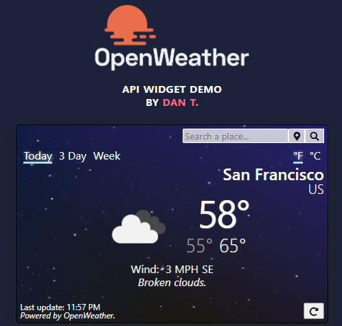

# OpenWeather API Weather Widget
A weather widget which uses the OpenWeather API to update temperatures. 

## Features
- Search any location in the world.
- View today's temperature, the next three days, or for the next 7 days. 
- View temperatures in C or F.
- Background colors change based on the weather condition and time of day of the location.
- Remembers your last searched location.

## Usage
- To get a weather widget on a webpage, simply invoke the constructor with your API key.
- Append the widget using the `.widget` property anywhere on your page.

## Technical Details
- Built with vanilla JS and CSS
- Utilizes ES6 promises, fetch API, and async / await.
- Tooling includes webpack and npm.
